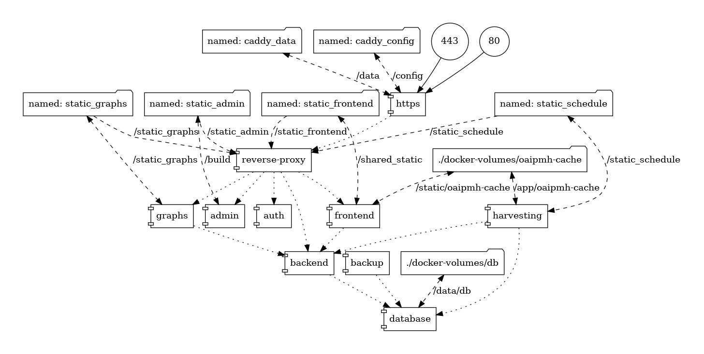

# Documentation for maintainers

## Checking if there's any documentation with invalid links

The repository comes with documentation spread out over multiple MarkDown files.
[This workflow file](./../.github/workflows/markdown-link-checker.yml) is set up to check whether there are broken links in
any of them. If you want to check this locally, you can do so with:

```shell
# from the repository root directory
npm install
npm run mlc
```

## Visualizing ``docker-compose.yml``

It is sometimes helpful to visualize the structure in the ``docker-compose.yml`` file.
Use [https://github.com/pmsipilot/docker-compose-viz](https://github.com/pmsipilot/docker-compose-viz) to generate a png image.

```shell
docker run --rm -it --name dcv -v $(pwd):/input pmsipilot/docker-compose-viz \
   render -m image --output-file=docs/images/docker-compose.png docker-compose.yml
```

For example,



## Making a release

1. Write the release notes
1. Update CITATION.cff
1. Generate the metadata file for Zenodo using [cffconvert](https://pypi.org/project/cffconvert/).

    ```shell
    pip install --user cffconvert
    cffconvert --outputformat zenodo --ignore-suspect-keys --outfile .zenodo.json
    ```

    ```shell
    # git add, commit, and push everything
    ```

1. Make sure that everything is pushed

    ```shell
    cd $(mktemp -d)
    git clone https://github.com/research-software-directory/research-software-directory.git
    cd research-software-directory
    ```

1. Follow the notes from the ['For developers'](#documentation-for-developers) section above, and verify that it all works as it should.
1. Use GitHub's ``Draft a new release`` button [here](https://github.com/research-software-directory/research-software-directory/releases) to make a release.

## Pulling in changes from upstream using a three-way merge

Set ``UPSTREAM`` and ``DOWNSTREAM`` to the different sources you want to
three-way merge between, e.g.

```shell
UPSTREAM=https://github.com/research-software-directory/research-software-directory.git
DOWNSTREAM=https://github.com/process-project/research-software-directory.git
```

Then:

```shell
cd $(mktemp -d)
mkdir left middle right
cd left && git clone $UPSTREAM . && cd -
cd middle && git clone $DOWNSTREAM . && git branch develop && git checkout develop && cd -
cd right && git clone $DOWNSTREAM . && cd -
meld left middle right &
```

You should only make changes to the ``middle`` one. When you're done making your changes,

```shell
git add <the files>
git commit
git push origin develop
```
